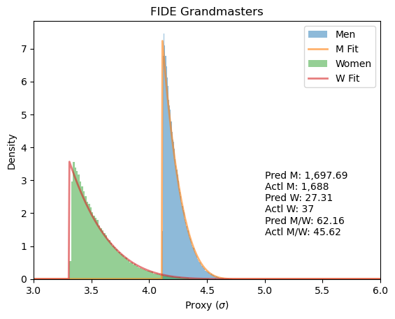
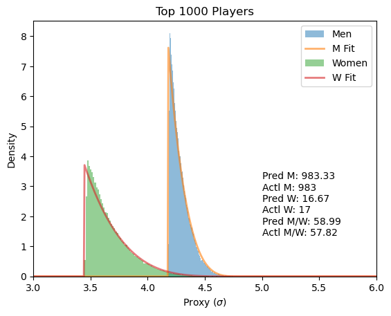

# Participation Rates Explain Top-Level Group Disparities: Why Women Are Not Worse Than Men at Chess

DISCLAIMER: As of 2023-12-18, this research is extremely preliminary and has not been peer-reviewed.

Using extreme value theory, I show that women are not intellectually inferior to men at chess,
despite what appears to be lopsided ratios at the top level.

Please look at
[fide-based-chess-analysis.ipynb](https://github.com/viamiraia/participation-gaps/blob/main/fide-based-chess-analysis.ipynb).

## Overview

It's commonly argued that there are innate differences between men and women when it comes to
chess. One of the pieces of evidence pointed at is the lopsided ratios of men vs women at the
highest levels of competition. In addition, these ratios appear to support the controversial
variance hypothesis, where men supposedly have higher variance in several domains, such as
intelligence.

Here I debunk the idea that these ratios prove innate differences between men and women in
chess. The overall process is as follows:

1. From the general population, acquire a distribution of active chess players.
2. From the active chess player distribution, acquire the male and female distributions for FIDE-rated
   chess players, and predict the expected gender composition.
3. From the distribution of rated chess players, predict the gender ratios for top players
   subpopulations, such as GMs, players rated over 2400, and top 1000 players.

I use data from 2020. The only data points used for prediction are:

- % of active chess players from the general population (~15%)
- % of women chess players (around 8.2% to 10.1%)
- the overall size of subpopulations, without knowing gender ratios (ex. 1725 GMs)
The predictions are remarkably accurate.

In addition, this method of analysis is generalizable to any rankable activity where one
subpopulation drastically outnumbers the other at extreme levels of competition. For example, we
expect there to be a difference in sports. However, we can figure out how much of the difference
is innate vs due to initial participation rates.

## Choice Figures





## TODO List

- [ ] ⏫ Acquire other ranked datasets and activities to test with ➕ 2023-12-18
  - [ ] Labor participation and richest people ➕ 2023-12-18
  - [ ] Sports where men and women should be equal or near equal, like archery, pool, fishing,
    shooting. ➕ 2023-12-18
  - [ ] Sports where men and women aren't expected to be equal, like weightlifting and running. ➕ 2023-12-18
  - [ ] Successful entrepreneurship ➕ 2023-12-18
  - [ ] Racial disparities➕ 2023-12-18
- [ ] ⏫ Double-check methods. ➕ 2023-12-18
- [ ] ⏫ Graph relationship between top-n size and gender ratio ➕ 2023-12-18
- [ ] 🔼 Cleanup Repository➕ 2023-12-18
  - [ ] Create changelog➕ 2023-12-18
  - [ ] Re-structure folders➕ 2023-12-18
- [ ] 🔼Implement fast top-n samples for extreme distributions if possible, based on [the method for normal distributions](https://stats.stackexchange.com/questions/579800/fast-top-n-from-samples-of-many-different-normal-distributions)➕ 2023-12-18
- [ ] 🔼 Perform best-distribution WAIC analysis. ➕ 2023-12-18
- [ ] 🔼 Perform Bayesian analysis to acquire credible intervals for estimates. ➕ 2023-12-18
- [ ] Research existing papers➕ 2023-12-18
- [ ] Examine time lag effects, e.g. participation rate changes, how long until top-level changes? ➕ 2023-12-18
- [ ] Investigate the combinatory effect of different-sized groups with different participation rates.➕ 2023-12-18

## License

In the spirit of open science and open source, I'm documenting my research as it progresses in
this repository. The code is MIT licensed.

## Citation

If you use or incorporate ideas from this software/study, please cite it as below.

```
@software{Chiou_Participation_Rates_Explain_2023,
    author = {Chiou, Miraia},
    month = dec,
    title = {{Participation Rates Explain Top-Level Group Disparities: Why Women Are Not Worse Than Men at Chess}},
    url = {https://github.com/viamiraia/participation-gaps},
    version = {0.0.4},
    year = {2023}
}
```
